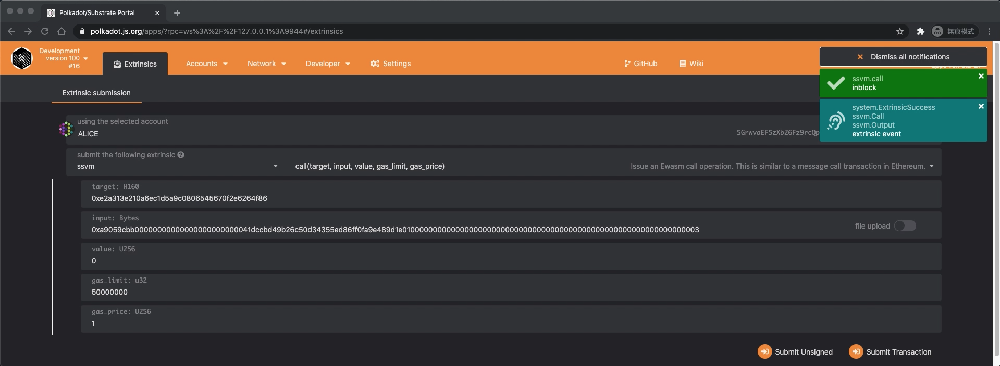

# Interact using Substrate web UI

## Build & Run node

We use [secondstate/substrate-ssvm](https://hub.docker.com/r/secondstate/substrate-ssvm) as building & running environment:

```bash
> git clone https://github.com/second-state/substrate-ssvm-node.git
> docker run -it --rm \
  --name substrate-ssvm \
  -p 9944:9944 \
  -v $(pwd):/root/node \
  -w /root/node/substrate-ssvm-node \
  secondstate/substrate-ssvm:latest \
  /bin/bash -c "make init && make build && cargo run --release --bin ssvm-node -- --dev --ws-external"
```

> **Remember to publish 9944 port from container to use Substrate web UI.**

## Connect to node

- Open https://polkadot.js.org/apps in the browser.
- In [settings](https://polkadot.js.org/apps/#/settings), make sure you select `Local Node`.


## Create Contract

Here we use the following ERC20 contract files as an example:
- [erc20.sol](./erc20/erc20.sol)
  - This file is an ERC20 contract written in Solidity.
- [erc20.wasm](./erc20/erc20.wasm)
  - This file is a wasm file generate from `erc20.sol` by [SOLL](https://github.com/second-state/soll)
  - Command to generate wasm file: `soll -deploy=Normal erc20.sol`
- [erc20.hex](./erc20/erc20.hex)
  - To deploy the wasm file to our node, we need to convert `erc20.wasm` to hex.
  - Command to generate hex file: `xxd -p erc20.wasm | tr -d $'\n' > erc20.hex`

- In [Extrinsics](https://polkadot.js.org/apps/#/extrinsics), select `ssvm` and `create`.
- Put the content of [erc20.hex](./erc20/erc20.hex) in the `code` section.
- Select proper gas limit & gas price.
- Submit Transaction


The contract will be deployed at address `0xe2a313e210a6ec1d5a9c0806545670f2e6264f86`.


## Interact with contract

### Get ERC20 balance of Alice:

- Prepare call data:
  - In EVM, call data is in `{function signature}{function arguments}` format
  - Data of `balanceOf(Alice)` is `0x70a082310000000000000000000000009621dde636de098b43efb0fa9b61facfe328f99d`
- In [Extrinsics](https://polkadot.js.org/apps/#/extrinsics), select `ssvm` and `call`.
- Fill contract address `0xe2a313e210a6ec1d5a9c0806545670f2e6264f86` in target section.
- Fill call data in input section.
- Select proper gas limit & gas price.
- Submit Transaction


The output `0x00000000000000000000000000000000000000000000000000000000000003e8` shows that Alice has 0x3e8 = 1000 ERC20 tokens.


### Transfer 3 tokens from Alice to Bob:

- Prepare call data:
  - Data of `transfer(Bob, 3)` is `0xa9059cbb00000000000000000000000041dccbd49b26c50d34355ed86ff0fa9e489d1e010000000000000000000000000000000000000000000000000000000000000003`
- In [Extrinsics](https://polkadot.js.org/apps/#/extrinsics), select `ssvm` and `call`.
- Fill contract address `0xe2a313e210a6ec1d5a9c0806545670f2e6264f86` in target section.
- Fill call data in input section.
- Select proper gas limit & gas price.
- Submit Transaction



The output `0x0000000000000000000000000000000000000000000000000000000000000001` shows that function call is success.


## Check ERC20 balance of Alice again

- Prepare call data:
  - Data of `balanceOf(Alice)` is `0x70a082310000000000000000000000009621dde636de098b43efb0fa9b61facfe328f99d`
- In [Extrinsics](https://polkadot.js.org/apps/#/extrinsics), select `ssvm` and `call`.
- Fill contract address `0xe2a313e210a6ec1d5a9c0806545670f2e6264f86` in target section.
- Fill call data in input section.
- Select proper gas limit & gas price.
- Submit Transaction
- And try again with 0x70a0823100000000000000000000000041dccbd49b26c50d34355ed86ff0fa9e489d1e01

The output `0x00000000000000000000000000000000000000000000000000000000000003e5` shows that Alice has 0x3e5 = 997 ERC20 tokens after transfering.

The output `0x0000000000000000000000000000000000000000000000000000000000000003` shows that Bob has 3 ERC20 tokens after transfering.

